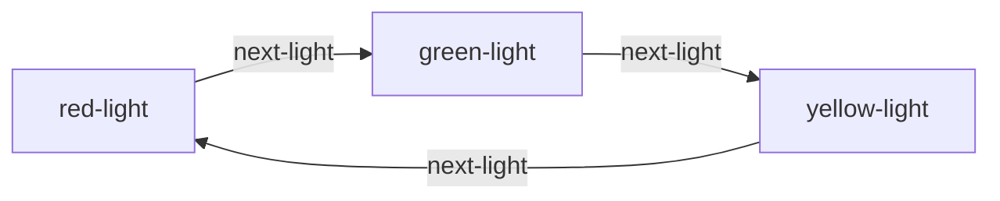
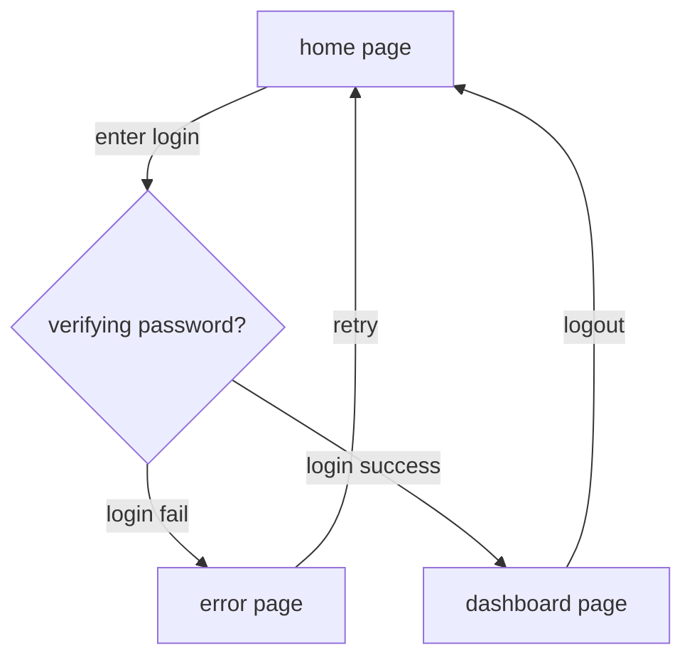

# Fancy State Machine

Type-safe, composable, seamless data flow Finite-state machine implementation in TypeScript.

## Installation

```sh
npm i fancy-state-machine
yarn add fancy-state-machine
```

## Simple usage

### Traffic light

A traffic light consist of 3 colors red, green and yellow normally will have the following flow.



This flow can be model using `fancy-state-machine` as follows:

```ts
// ./examples/traffic-light.ts#L1-L14

import { FSMBuilder } from 'fancy-state-machine';

const trafficLightFsmBuilder = FSMBuilder.create()
    .addEvent<'next-light'>()

    .addState('red-light')
    .addState('green-light')
    .addState('yellow-light')

    //             fromState       event       targetState
    .addTransition('red-light', 'next-light', 'green-light')
    .addTransition('green-light', 'next-light', 'yellow-light')
    .addTransition('yellow-light', 'next-light', 'red-light');

```

Here are some notes:

- `addEvent` is called with generic paremters because it is only used for decorating the type of the FSM. The events are not stored directly, but only in the transitions.
- The `addTransition` is **type-safe**. Meaning you can only pass in the **defined** events and **states**.


This builder can be used to build FSM and run like this:

```ts
// ./examples/traffic-light-usage.ts#L3-L13

async function main() {
    const fsm = trafficLightFsmBuilder.build('green-light'); // pass in initial state

    console.log(fsm.stateData); // ['green-light']
    await fsm.dispatch('next-light');
    console.log(fsm.stateData); // ['yellow-light']
    await fsm.dispatch('next-light');
    console.log(fsm.stateData); // ['red-light']
    await fsm.dispatch('next-light');
    console.log(fsm.stateData); // ['green-light']
}
```

- The `dispatch` function accept a predefined _event_. It is also type-safe.
- The `dispatch` function is `async`, allowing more complex usage later on.
- The `stateData` is a tuple. This is because it can hold additional data. It will be explained in the later example.

## Motivation

Have you ever wondered how the _data handling_ part happens when using a Finite State Machine (FSM)?

Let's take a look at one example. The following is a simple login flow.



This login flow is actually popular when talking about FSM in UI design. But I still find this example is very abstract. The thing that bugs me the most is still the data storage. Let's see what kind of data are required in each state and each _events_.

- The _home page_ should not contains any user data.
- The _enter login_ event should be dispatched along side with the user login to the _verifying password_ state.
- The _login fail_ event should be dispatched along side with the reason.
- The _login success_ event should be dispatched along side with the _login tokens_ to the dashboard page.
- The _logout_ event should _free_ the _login tokens_, so that when the user returned to the _home page_, there is no data.

