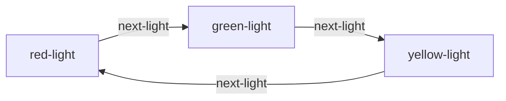
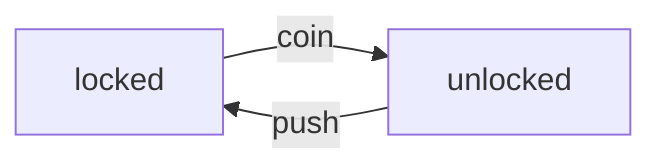
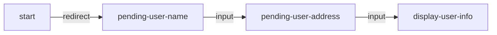
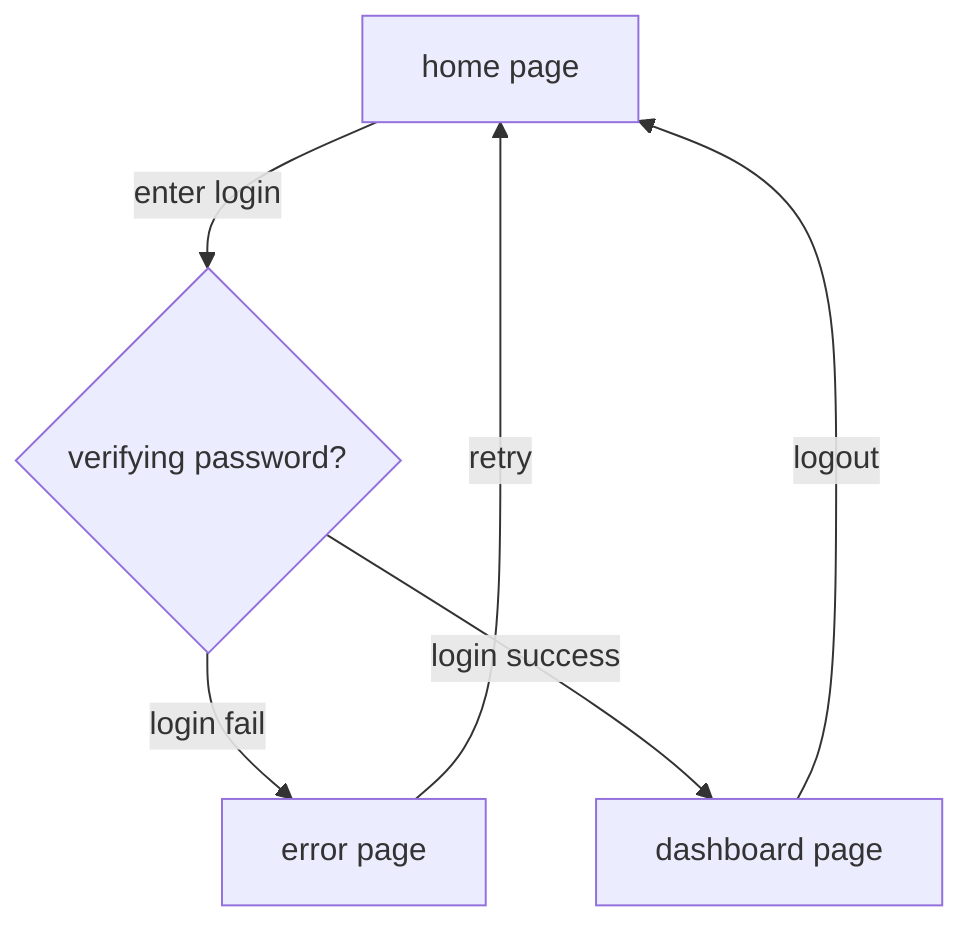
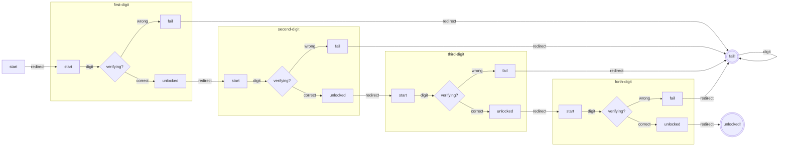

# Fancy State Machine

Type-safe, composable, seamless data flow Finite-state machine implementation in TypeScript.

## Installation

```sh
npm i fancy-state-machine
yarn add fancy-state-machine
```

## Simple usage

### Traffic light

A traffic light consist of 3 colors red, green and yellow normally will have the following flow.



This flow can be model using `fancy-state-machine` as follows:

```ts
// ./examples/traffic-light.ts#L1-L14

import { FSMBuilder } from 'fancy-state-machine';

const trafficLightFsmBuilder = FSMBuilder.create()
    .addEvent<'next-light'>()

    .addState('red-light')
    .addState('green-light')
    .addState('yellow-light')

    //             fromState       event       targetState
    .addTransition('red-light', 'next-light', 'green-light')
    .addTransition('green-light', 'next-light', 'yellow-light')
    .addTransition('yellow-light', 'next-light', 'red-light');

```

- `addEvent` is called with generic paremters because it is only used for decorating the type of the FSM. The events are not stored directly, but only in the transitions.
- The `addTransition` is **type-safe**. Meaning you can only pass in the **defined** events and **states**.

This builder can be used to build FSM and run like this:

```ts
// ./examples/traffic-light-usage.ts#L3-L13

async function main() {
    const fsm = trafficLightFsmBuilder.build('green-light'); // pass in initial state

    console.log(fsm.stateData); // ['green-light']
    await fsm.dispatch('next-light');
    console.log(fsm.stateData); // ['yellow-light']
    await fsm.dispatch('next-light');
    console.log(fsm.stateData); // ['red-light']
    await fsm.dispatch('next-light');
    console.log(fsm.stateData); // ['green-light']
}
```

- The `dispatch` function accept a predefined _event_. It is also type-safe.
- The `dispatch` function is `async`, allowing more complex usage later on.
- The `stateData` is a tuple. This is because it can hold additional data. It will be explained in the later example.

### [Simple turnstile](https://en.wikipedia.org/wiki/Finite-state_machine#Example:_coin-operated_turnstile)

The coin-operated turnstile will have the following flow:



Here the self-loop is omitted, for the shake of code illustration :smiley:. It can be model with `fancy-state-machine` as follows:

```ts
// ./examples/simple-turnstile.ts

import { FSMBuilder } from 'fancy-state-machine';

export const simpleTurnstileFsmBuilder = FSMBuilder.create()
    .addEvents<{
        coin: [];
        push: [];
    }>()

    .addState('locked')
    .addState('unlocked')

    .addTransition('locked', 'coin', 'unlocked')
    .addTransition('unlocked', 'push', 'locked');

```

- Here `addEvents` can be used to define multiple events at the same time. Both `addEvent` and `addEvents` return `this` object but casted to the newly decorated type, so calling these function multiple time might have overhead. `addEvents` can be use to reduce these calls into one, while `addEvent` can be used for readability. Since this is up to the compiler, which one to use is only the stylistic choice.
- `addEvents` accepts a mapping in its generic parameters, and the values are also tuples! This part declare which data can be pass along with an event. Since the event in our model does not have any additional data, we can leave them blank.

We can start using the builder just like the traffic light example, but if we dispatch an event that causes an undefined transition, we will have an error:

```ts
// ./examples/simple-turnstile-usage.ts#L3-L6

async function failed() {
    const fsm = simpleTurnstileFsmBuilder.build('locked');
    await fsm.dispatch('push'); // this throw error
}
```

Don't worry though, `fancy-state-machine` allow this to be ignore. When there is an undefined transition, the state remains the same. This effectively close the loop for us in the model.

```ts
// ./examples/simple-turnstile-usage.ts#L8-L21

async function pass() {
    const fsm = simpleTurnstileFsmBuilder.build('locked').setOptions({ ignoreInvalidTransition: true });

    await fsm.dispatch('push');
    console.log(fsm.stateData); // ['locked']
    await fsm.dispatch('coin');
    console.log(fsm.stateData); // ['unlocked']
    await fsm.dispatch('coin');
    console.log(fsm.stateData); // ['unlocked']
    await fsm.dispatch('push');
    console.log(fsm.stateData); // ['locked']
    await fsm.dispatch('push');
    console.log(fsm.stateData); // ['locked']
}
```

If you find the set option part is lengthy, `fsm.clone()` can be used to clone the `fsm` from the existing FSM.

## Passing data between states and events

### Forward data flow

Imagine are wring a CLI app that asks for user name and address. We can have the simple model as follows:



So when the app started, it is redirected to ask the user name. After that it will ask the user's address,
and when these information are gathered, the will display it back to the user.

The `input` event, in most of the implementation, will come with the user input, meaning this event will come with data. `fancy-state-machine` allows to model the event come with additional data and can be passed in the state!

```ts
// ./examples/simple-cli-app.ts

import { FSMBuilder } from 'fancy-state-machine';

export const simpleCliFsmBuilder = FSMBuilder.create()
    .addEvent<'input', [line: string]>()
    .addEvent<'redirect'>()

    .addState('start')
    .addState('pending-user-name', () => {
        console.log('What is your name?');
    })
    .addState('pending-user-address', async (userName: string) => {
        console.log(`Nice to meet you, ${userName}! Where do you live?`);
    })
    .addState('display-user-info', (userName: string, address: string) => {
        console.log(`I see. I will visit your home at ${address}. See ya, ${userName}!`);
    })

    .addTransition('start', 'redirect', 'pending-user-name')
    .addTransition('pending-user-name', 'input', 'pending-user-address')
    .addTransition('pending-user-address', 'input', 'display-user-info');

```

- The event `input` come with an input `line: string`.
- Each state can be defined with an additional handler. This is called `enterHandler`, and will be called each time the state is visited.
- The `enderHandler` can be `async`. When `dispatch` is called, the `enterHandler` will also be called and awaited before returning to the caller.
- The `enterHandler` accepts some arguments. These are arguments are the `state data`.
- The `state data` must be either passed in `fsm` when initialized, or **pass along the transition**.

#### The data forwarding rule

How exactly the data is passed along the transition in this example? Formally, suppose we have a transition from state `A` to state `B` with the event `E`. As you can see, all of the `state data` and the `event data` are **tuples**. So the `state data` of `B` must be the **concatenation** of the `state data` of `A` and `event data` of `E`. That is:

```ts
StateData[B] = [...StateData[A], ...EventData[E]]
```

If you take a look at the previous example, the _data forwarding rule_ is also satisfied, as all the `state data` and `event data` are empty tuples.

Note that `addTransition` is also type-safe and follows this rule. If a transition is created that does not follow the mentioned _data forwarding rule_, `addTransition` will return `never`.

### Dispatching events

Now our `events` also has data along side with its, we can also pass it to the `dispatch` function.

```ts
// ./examples/simple-cli-app-usage.ts#L3-L17

async function main() {
    const fsm = simpleCliFsmBuilder.build('start');

    console.log(fsm.stateData); // ['start']
    await fsm.dispatch('redirect');
    // What is your name?
    console.log(fsm.stateData); // ['pending-user-name']
    await fsm.dispatch('input', 'John');
    // Nice to meet you John! Where do you live?
    console.log(fsm.stateData); // ['pending-user-address', 'John']
    await fsm.dispatch('input', 'the moon');
    // I see. I will visit your home at the moon. See ya, John!
    console.log(fsm.stateData); // ['display-user-info', 'John', 'the moon']
}

```

- The `event data` is pass after the `event` name. This can be archived thanks to rest-parameters!
- Also note that this function is also type-safe: the `event data` must have the corresponding type to its event name.
- In the same vein, the `state data` is also stored in the same manner: using tuple. When visiting a state, the `enterHandler` will be called with this `state data` (minus the state name of course).

### Custom transition handler: transition everywhere

Let's take a look at a more realistic example. The following is a simple login flow.



This login flow is actually popular when talking about FSM in UI design. But I still find this example is very abstract. Let's take a closer look at this flow by analyzing the event data:

- The _home page_ should not contains any user data.
- The _enter login_ event should be dispatched along side with the user login to the _verifying password_ state.
- The _login fail_ event should be dispatched along side with the reason.
- The _login success_ event should be dispatched along side with the _login tokens_ to the dashboard page.
- The _logout_ event should _free_ the _login tokens_, so that when the user returned to the _home page_, there is no data.

This flow does not follow the _data forwarding rule_ at all! In this case, `fancy-state-machine` allow explicit custom transition handler for the transition data transformation. The login flow can be modeled as follows:

```ts
// ./examples/login-flow.ts

import { FSMBuilder } from 'fancy-state-machine';

const loginFlowFsm = FSMBuilder.create()
    .addEvent<'enter login', [{ userName: string; password: string }]>()
    .addEvent<'login fail', [reason: string]>()
    .addEvent<'login success', [userToken: string]>()
    .addEvent<'logout'>()
    .addEvent<'retry'>()

    .addState('home page')
    .addState('verifying password?', (userData: { userName: string; password: string }) => {})
    .addState('error page', (reason: string) => {})
    .addState('dashboard page', (userToken: string) => {})

    .addTransition('home page', 'enter login', 'verifying password?')
    .addTransition('verifying password?', 'login fail', 'error page', (_userData, reason) => {
        // drop userData and return the reason only
        return [reason];
    })
    .addTransition('verifying password?', 'login success', 'dashboard page', (_userData, userToken) => {
        // drop userData and return the token only
        return [userToken];
    })
    .addTransition('error page', 'retry', 'home page', () => {
        // drop everything, return to blank state
        return [];
    })
    .addTransition('dashboard page', 'logout', 'home page', () => {
        // drop everything, return to blank state
        return [];
    });

export { loginFlowFsm };

```

- Transition that does not follow the _data forwarding rule_ **MUST** contains the an additional function called the `transition handler`. When transitioning from the state `A` to state `B` when the event `E` is dispatched, the `transition handler` is used to transform the concatenation of `[...StateData[A], ...EventData[E]]` into `StateData[B]`.
- Transition that follows the _data forwarding rule_ can still has the `transition handler`, but its return type must match `StateData[B]`.
- The default `transition handler` of the transition handler following the _data forwarding rule_ is the _echo_ function: `(...params) => params`.
- The current way to define the `state data` type is to define the `enter handler`. To be honest I can't find a _better_ way to do this without specifying the function. To do this, one can call `.addState<'state', [...]>('state')`, but the `'state'` will be repeated twice.

Here is the usage of the FSM:

```ts
// ./examples/login-flow-usage.ts

import { loginFlowFsm } from './login-flow';
import assert from 'assert';

async function login() {
    const fsm = loginFlowFsm.build('home page');

    async function tryLogin() {
        assert(fsm.stateData[0] === 'verifying password?');
        // get the state right from fsm.
        const accessTokenOrError = await verifyLogin(fsm.stateData[1].userName, fsm.stateData[1].password);

        if (accessTokenOrError instanceof Error) {
            await fsm.dispatch('login fail', accessTokenOrError.message);
            await fsm.dispatch('retry');
        } else {
            await fsm.dispatch('login success', accessTokenOrError);
            // now user will use the app for a while
            // then logout
            await fsm.dispatch('logout');
        }
    }

    // wrong login
    await fsm.dispatch('enter login', { userName: 'user1', password: 'bruh' });
    await tryLogin();
    await fsm.dispatch('enter login', { userName: 'whoami', password: 'idontknow' });
    await tryLogin();

    // correct login
    await fsm.dispatch('enter login', { userName: 'demo_account', password: '1234pass5678' });
    await tryLogin();
}

const Users = new Map([
    ['user1', 'Password123'],
    ['testuser', '9876abcd'],
    ['sample_user', 'passWORD456'],
    ['newuser123', 'mySecret789'],
    ['demo_account', '1234pass5678'],
    ['access_granted', 'secureAccess99'],
    ['alpha_beta', 'BetaAlpha#1'],
    ['user42', 'Pass123word!'],
    ['temp_user', 'samplePass789'],
    ['guest123', 'Welcome567!'],
]);

async function verifyLogin(userName: string, password: string) {
    const userData = Users.get(userName);
    if (userData !== password) return new Error(`wrong username or password`);
    return '<ACCESS_TOKEN>';
}

```

## Self-emitting event

Let's take a look at the login flow example. Currently the verification logic is separated from the state. This is fine, but sometimes we want to have more flexibility, by embedding the logic alongside the state. `fancy-state-machine` allowing this. The `enter handler`, additionally can return the `event data` that it want to be fired right after.

The login can be re-model like this:

```ts
// ./examples/login-flow-2.ts

import { FSMBuilder } from 'fancy-state-machine';

const loginFlowFsm = FSMBuilder.create()
    .addEvent<'enter login', [{ userName: string; password: string }]>()
    .addEvent<'login fail', [reason: string]>()
    .addEvent<'login success', [userToken: string]>()
    .addEvent<'logout'>()
    .addEvent<'retry'>()

    .addState('home page')
    .addState('verifying password?', async ({ userName, password }: { userName: string; password: string }) => {
        const Users = new Map([
            ['user1', 'Password123'],
            ['testuser', '9876abcd'],
            ['sample_user', 'passWORD456'],
            ['newuser123', 'mySecret789'],
            ['demo_account', '1234pass5678'],
            ['access_granted', 'secureAccess99'],
            ['alpha_beta', 'BetaAlpha#1'],
            ['user42', 'Pass123word!'],
            ['temp_user', 'samplePass789'],
            ['guest123', 'Welcome567!'],
        ]);

        const userData = Users.get(userName);
        if (userData !== password) return ['login fail', 'wrong username or password'];
        return ['login success', '<ACCESS_TOKEN>'];
    })
    .addState('error page', (reason: string) => {})
    .addState('dashboard page', (userToken: string) => {})

    .addTransition('home page', 'enter login', 'verifying password?')
    .addTransition('verifying password?', 'login fail', 'error page', (_userData, reason) => {
        // drop userData and return the reason only
        return [reason];
    })
    .addTransition('verifying password?', 'login success', 'dashboard page', (_userData, userToken) => {
        // drop userData and return the token only
        return [userToken];
    })
    .addTransition('error page', 'retry', 'home page', () => {
        // drop everything, return to blank state
        return [];
    })
    .addTransition('dashboard page', 'logout', 'home page', () => {
        // drop everything, return to blank state
        return [];
    });

export { loginFlowFsm };

```

Notice now the verification logic is embed right in the `verifying password?` state. Its `enter handler` return the event (`eventName` and `event data`) that it wants to be fired afterward.

When `dispatch` is called, if the new visited state's `enter handler` returned the new events, `dispatch` will continue transition, until it has visited the state with `enter handler` that returns nothing. So now, when calling `await fsm.dispatch('enter login', { ... })`, the resulting state will be either `error page` or `dashboard page`.

## Composing FSM

`fancy-state-machine` also has capability to compose smaller `FSM` into a larger one via `.embed` and `.scope` method. Let's take a look at the following example: `password`.

The user is allowed to enter a 4-digit password, each digit is from 1 to 4. The checking flow will be as follows:



Here I'm using `digit` event instead, since we already have event with data attached. Here each digit is a single FSM to check if the inputting digit is the correct one, and it short-circuits to `fail` in case of incorrect. We can see that all 4 sub-FSM have the same structure, so we can see that we should be able to compose them somehow.

`fancy-state-machine` comes to rescue with the following model:

```ts
// ./examples/password.ts

import { FSMBuilder } from 'fancy-state-machine';

type Digit = 1 | 2 | 3 | 4;
function createSingleDigitPassword(pass: Digit) {
    return FSMBuilder.create()
        .addEvent<'digit', [d: Digit]>()
        .addEvent<'wrong'>()
        .addEvent<'correct'>()
        .addEvent<'redirect'>()

        .addState('start')
        .addState('unlocked', () => ['redirect'])
        .addState('fail', () => ['redirect'])
        .addState('verifying?', (d: Digit) => {
            return d === pass ? ['correct'] : ['wrong'];
        })
        .addTransition('start', 'digit', 'verifying?')
        .addTransition('verifying?', 'wrong', 'fail', () => [])
        .addTransition('verifying?', 'correct', 'unlocked', () => []);
}

export const passwordFSMBuilder = FSMBuilder.create()
    .embed(createSingleDigitPassword(4).scope('first-digit.'))
    .embed(createSingleDigitPassword(2).scope('second-digit.'))
    .embed(createSingleDigitPassword(1).scope('third-digit.'))
    .embed(createSingleDigitPassword(3).scope('forth-digit.'))

    .addState('start', () => ['redirect'])
    .addState('unlocked!')
    .addState('fail!')

    .addTransition('start', 'redirect', 'first-digit.start')
    .addTransition('first-digit.unlocked', 'redirect', 'second-digit.start')
    .addTransition('second-digit.unlocked', 'redirect', 'third-digit.start')
    .addTransition('third-digit.unlocked', 'redirect', 'forth-digit.start')
    .addTransition('forth-digit.unlocked', 'redirect', 'unlocked!')
    .addTransition('first-digit.fail', 'redirect', 'fail!')
    .addTransition('second-digit.fail', 'redirect', 'fail!')
    .addTransition('third-digit.fail', 'redirect', 'fail!')
    .addTransition('forth-digit.fail', 'redirect', 'fail!')
    .addTransition('fail!', 'digit', 'fail!', () => []);

```

Here is a model to check if the password `4, 2, 1, 3` is inputted.

Let's take a look at `createSingleDigitPassword`:

- This function creates the sub-FSM to check the single digit.
- The `verifying?` state checks if the inputted digit `d` is the same as the parameters, and fire the corresponding events.
- The _out_ states `fail` and `unlock` fire the event `redirect` immediately. This will be used to plug the states in the large FSM.

Now for the large FSM:

- There are 4 statements `.embed(createSingleDigitPassword(...).scope(...))`, that will embed 4 sub-FSM into this large FSM.
- The `scope(s)` function will transform the state of the sub-FSM to have the prefix of `s`. So when calling `.scope('first-digit.')`, we have the following transformation:
  - `start` -> `first-digit.start`
  - `verifying?` -> `first-digit.verifying?`
  - `unlocked` -> `first-digit.unlocked`
  - `fail` -> `first-digit.fail`
- With all 4 sub-FSM embedded with renamed states, we can redirect the states:
  - All the `fail` states will be redirect to the final `fail!` state.
  - The `unlocked` states of the previous digit will be redirected to the next `start` state of the next digit.

This gives us a very powerful tool to compose FSM that can only be found in textbook, and it is now realized in TypeScript! But beware that the number of states will be exponentially increased when more layer of FSM are composed with each other.

## Other functionalities

### Clone `FSMBuilder`

Every `FSMBuilder` method is **multable**, except `clone` that does what it says. So be careful not to share `FSMBuilder`, including alternate it after a `FSM` instance was built.

### `FSM#fullDispatch`

`FSM` instance has a _better_ `dispatch` method called `fullDispatch`, which accepts more parameters.
It has the following signature:

```js
FSM#fullDispatch(events, options?)
```

- Events is the event name with `event data` tuple, that is, `fsm.dispatch('event', data1, data2, ...)` is equivalent to `fsm.fullDispatch(['event', data1, data2])`.
- `options` is an object, allowing to specify additional functionality:
  - `ignoreInvalidTransition?: boolean` - this property is the same one as the `FSM#options`. Setting this to true to ignore the _invalid_ transition. The default is of course `FSM#options#ignoreInvalidTransition`.
  - `onTransition?: (fromState, event, targetState) => void` - callback to listen when a transition happens. The state is the state name with `state data` tuple, and `event` is the event name with `event data` tuple.
  - `onInvalidTransition?: (fromState, event) => void` - callback to listen when an invalid transition happens. The state is the state name with `state data` tuple, and `event` is the event name with `event data` tuple.

### `FSM#drain`

Come back to the simple CLI app example. The `start` state has one transition, which is when `redirect` was fired. Normally `start` is also the initial start that we set. But what happens when `start` start's `enter handler` return `redirect` immediately? This means when `fsm` is initialized, we are at `start`, not where `start` is redirected.

I intend to not make that immediate transition.

- The initialization is a `sync` process, while `dispatch` is `async`.
- Standing right at the initialized state still make more sense and the behavior is more consistent. Think of the initialized state as _not entered_, and we simply just stand there.

However, immediately transition might be the desired behavior. In this case, `FSM#drain` can be called right after initialization (and in an `async` context) to get the immediate events.

`FSM#drain` accepts an additional optional param called `options`, which is the same `options` as `FSM#fullDispatch`, since it will be passed in `FSM#fullDispatch`.

### `renderToMermaid`

All the above flow/state chart are rendered into [`mermaid`](https://mermaid.js.org) using the `renderToMermaid` utility. It has the following signature:

```js
renderToMermaid(fsm, options?)
```

- `fsm` is either `FSMBuilder` or `FSM` instance.
- `options` is an optional object with the following property:
  - `direction?: 'LR' | 'TD' | 'BT' | 'RL` - specify the chart direction. Default is `TD`.
  - `subgraphNameSeparator?: string` - use to group states into subgraph. If unspecified, the state name stays the same. If specified, it is used as separate to split state name into parts, and state with similar parts will be grouped. For example, if `subgraphNameSeparator` is `.` and there are 4 states:
    - `foo.x.a`
    - `foo.x.b`
    - `foo.y.c`
    - `bar.x.d`

    Then `foo.x.a`, `foo.x.b` and `foo.y.c` will be grouped in a subgraph called `foo`. Further more, `foo.x.a` and `foo.x.b` will be grouped into a smaller subgraph in `foo` called `x`.

    An example is the `password` chart above, with sub-FSM grouped into subgraph, and this property is intended to be used with `FSMBuilder#scope` method.

## More application: state data transfer

Besides modeling perspective and state data management perspective, there is one more perspective that this library can be used, which is state data storage and transfer.

This library does not forbid which type can be used for `state data` and `event data`, but if `state data` is POJO, it can be easily serialized into `JSON` and stored elsewhere, effectively storing the program state. For `event data`, if it is POJO, it can be serialized and send over network, making this the [`command pattern`](https://refactoring.guru/design-patterns/command).

## More example

Check out the test for some more interesting example :sunglasses:.
